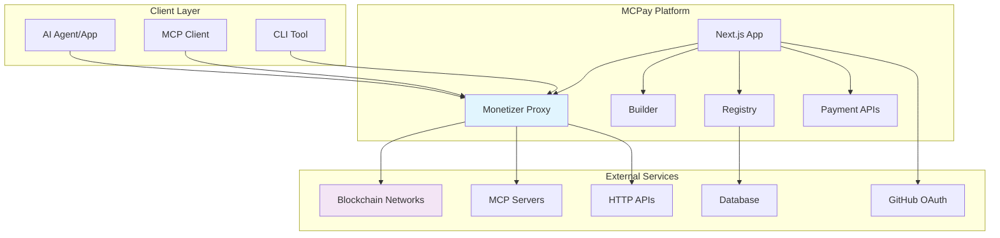
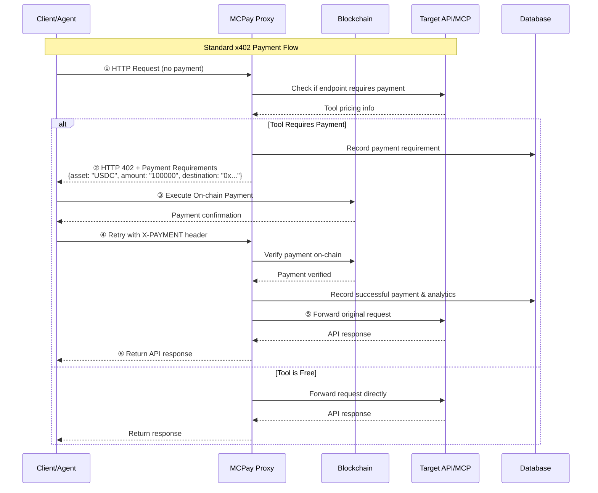
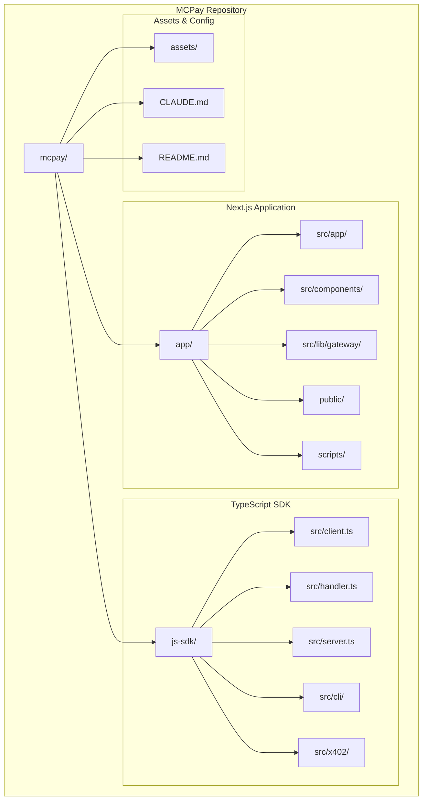
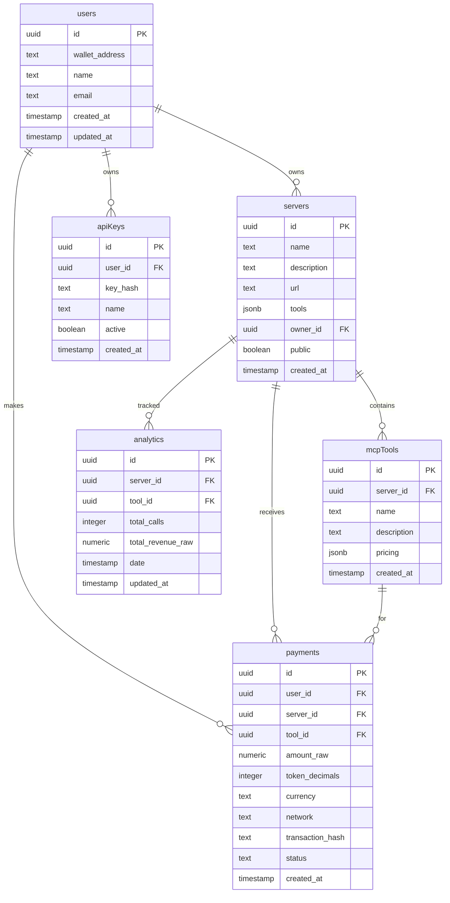
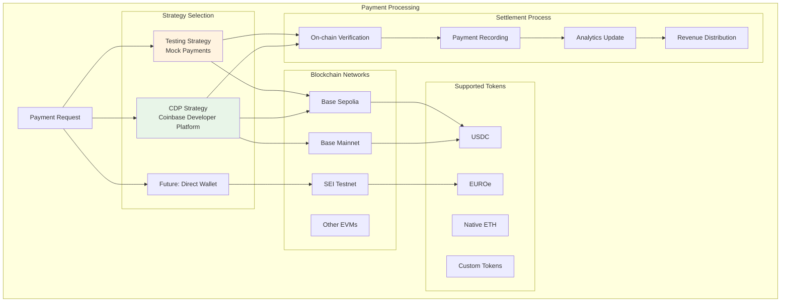
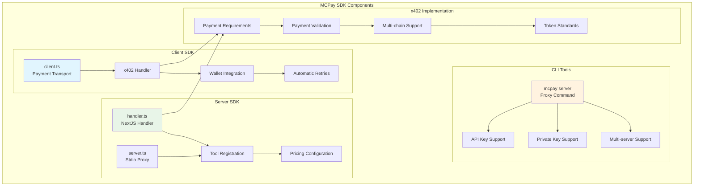
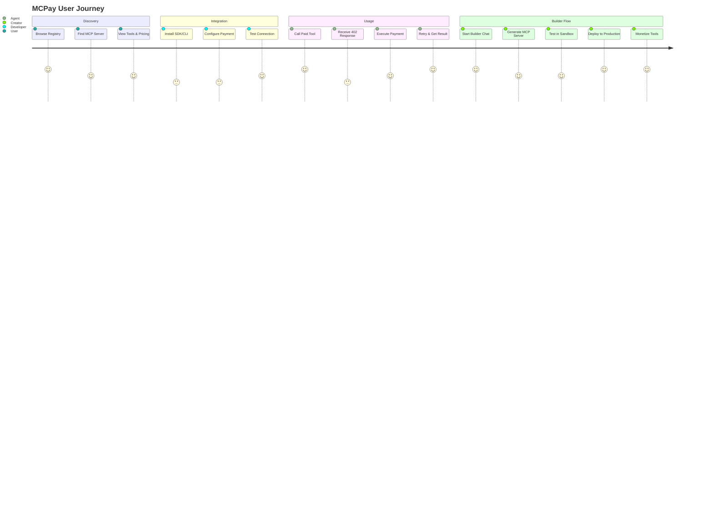
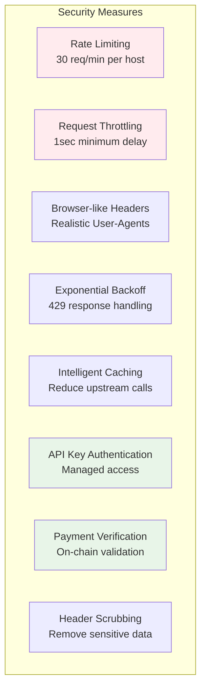
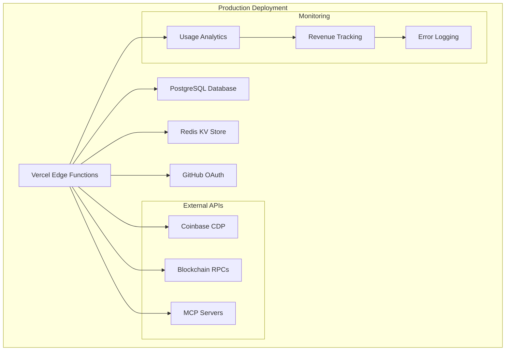

# MCPay Architecture Overview

MCPay is a payment layer for MCP (Model Context Protocol) servers and HTTP APIs that implements the **HTTP 402 Payment Required** status code with the **x402 pattern**. This document explains how the system works and its intended purpose through comprehensive Mermaid diagrams.

## Table of Contents
- [What MCPay Does](#what-mcpay-does)
- [High-Level System Architecture](#high-level-system-architecture)
- [Core x402 Payment Flow](#core-x402-payment-flow)
- [Repository Structure](#repository-structure)
- [Next.js App Architecture](#nextjs-app-architecture)
- [Database Schema Overview](#database-schema-overview)
- [Payment Strategy Architecture](#payment-strategy-architecture)
- [MCP Builder Flow](#mcp-builder-flow)
- [SDK/CLI Architecture](#sdkcli-architecture)
- [End-to-End User Journey](#end-to-end-user-journey)
- [Key Design Decisions](#key-design-decisions)
- [Security & Anti-Bot Features](#security--anti-bot-features)
- [Deployment Architecture](#deployment-architecture)
- [Future Roadmap Implications](#future-roadmap-implications)

## What MCPay Does

MCPay enables **micropayments for API calls** without subscriptions, manual API keys, or human sign-ups. It's designed for:
- **Developers**: Ship paid tools instantly without billing infrastructure
- **MCP Hosts**: Monetize each tool with per-call/per-token pricing
- **AI Agents**: Enable autonomous agent-to-service payments

## High-Level System Architecture



## Core x402 Payment Flow

The heart of MCPay is the x402 pattern that enables seamless micropayments:



## Repository Structure



## Next.js App Architecture

```mermaid
graph TB
    subgraph "Next.js App Structure"
        subgraph "Route Handlers (/api)"
            A1[/api/servers<br/>Registry API]
            A2[/api/chat<br/>Builder Chat]
            A3[/api/analytics<br/>Usage Data]
            A4[/api/auth<br/>Authentication]
            A5[/api/users<br/>User Management]
        end

        subgraph "Core Routes"
            B1[/mcp/:id/*<br/>MCP Proxy]
            B2[/requirements<br/>Payment Requirements]
            B3[/validate<br/>Payment Validation]
            B4[/ping<br/>Server Discovery]
        end

        subgraph "UI Pages"
            C1[/<br/>Homepage]
            C2[/servers<br/>Registry Browse]
            C3[/build<br/>MCP Builder]
            C4[/register<br/>Server Registration]
        end

        subgraph "Backend Services"
            D1[Gateway Layer<br/>lib/gateway/]
            D2[Database<br/>Drizzle ORM]
            D3[Authentication<br/>Better-auth]
            D4[Payment Strategies<br/>CDP/Testing]
        end
    end

    A1 --> D1
    A2 --> D1
    A3 --> D1
    B1 --> D1
    B2 --> D1
    B3 --> D1

    D1 --> D2
    D1 --> D3
    D1 --> D4

    style B1 fill:#e3f2fd
    style B2 fill:#e8f5e8
    style B3 fill:#e8f5e8
```

## Database Schema Overview



## Payment Strategy Architecture



## MCP Builder Flow

```mermaid
graph TB
    subgraph "MCPay Builder System"
        A[User starts chat at /build]

        subgraph "Chat Interface"
            B1[POST /api/chat]
            B2[MCP Client via HTTP Transport]
            B3[Tool Discovery & Testing]
            B4[Code Generation]
        end

        subgraph "Sandbox Environment"
            C1[Vercel Sandbox]
            C2[Live Preview]
            C3[Tool Testing]
            C4[Real-time Updates]
        end

        subgraph "Deployment"
            D1[GitHub Repository Creation]
            D2[Vercel Deployment]
            D3[MCPay Registration]
            D4[Monetization Setup]
        end

        subgraph "MCPay Build Server"
            E1[Template Generation]
            E2[Code Modification]
            E3[Tool Pricing Setup]
            E4[Production Deployment]
        end
    end

    A --> B1
    B1 --> B2
    B2 --> B3
    B3 --> B4

    B4 --> C1
    C1 --> C2
    C2 --> C3
    C3 --> C4

    C4 --> D1
    D1 --> D2
    D2 --> D3
    D3 --> D4

    B4 --> E1
    E1 --> E2
    E2 --> E3
    E3 --> E4

    style C1 fill:#e3f2fd
    style D2 fill:#e8f5e8
```



## SDK/CLI Architecture



## End-to-End User Journey



## Key Design Decisions

### 1. **Monetary Precision**
All amounts stored as `NUMERIC(38,0)` base units with `token_decimals` to avoid floating-point errors:
- 0.1 USDC = `amount_raw: 100000, token_decimals: 6`
- 1.5 ETH = `amount_raw: 1500000000000000000, token_decimals: 18`

### 2. **x402 Pattern Implementation**
- Returns structured payment requirements in 402 responses
- Supports automatic retry with `X-PAYMENT` header
- Enables seamless agent-to-service payments

### 3. **Multi-Strategy Payment Processing**
- **CDP (Coinbase Developer Platform) Strategy**: Production-ready Coinbase integration
- **Testing Strategy**: Development/testing with mocks
- **Extensible**: Easy to add new payment methods

### 4. **MCP Protocol Integration**
- Full MCP JSON-RPC support over HTTP
- Tool discovery and pricing metadata
- Seamless proxy with payment enforcement

## Security & Anti-Bot Features



## Deployment Architecture



## Future Roadmap Implications

The architecture is designed to support:
- **Multi-chain expansion**: Easy addition of new blockchain networks
- **Payment method diversity**: Credit cards, other cryptocurrencies
- **Advanced pricing models**: Dynamic pricing, tiered subscriptions
- **Enterprise features**: Bulk payments, usage quotas
- **Enhanced security**: Advanced rate limiting, fraud detection

This architecture enables MCPay to serve as a comprehensive payment infrastructure for the emerging ecosystem of AI agents and MCP servers, providing the foundation for a new economy of autonomous digital services.